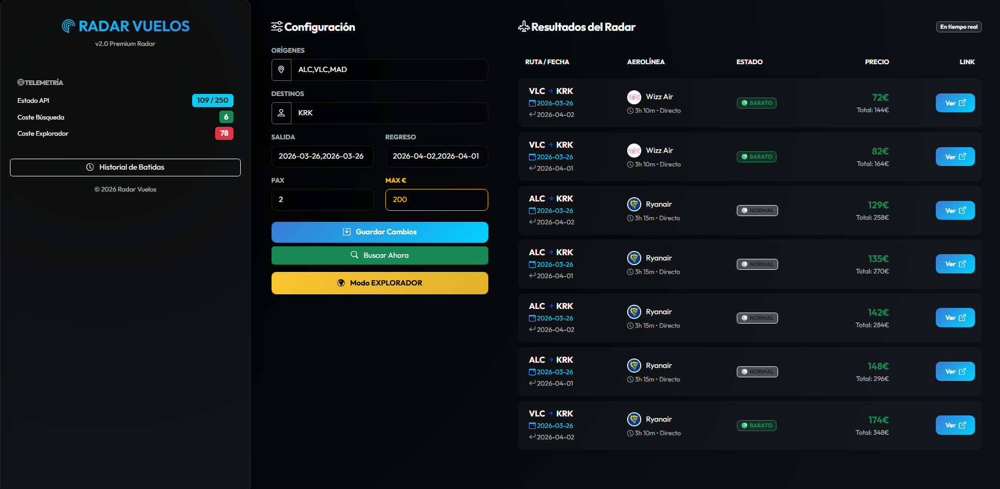

# ✈️ Sabueso: Radar de Vuelos Automatizado



> **"El Sabueso"** es una herramienta *self-hosted* diseñada para automatizar la búsqueda de vuelos baratos, gestionar presupuestos de viaje y notificar oportunidades en tiempo real mediante Telegram.

## 🧐 El Problema
Buscar vuelos baratos requiere constancia y tiempo. Las ofertas aparecen y desaparecen en horas. Quería una solución que:
1. No dependiera de mi memoria para buscar a diario.
2. Me avisara solo cuando el precio real bajara de mi presupuesto (por persona).
3. Fuera capaz de explorar múltiples destinos nórdicos y europeos automáticamente.

## 🚀 Funcionalidades Clave
* **📡 Motor de Búsqueda:** Integración con la API de Google Flights (vía SerpApi) para obtener datos en tiempo real.
* **🧠 Lógica Inteligente:** Filtra resultados basándose en un presupuesto máximo por pasajero. Si el vuelo es caro, lo ignora; si es un chollo, te avisa.
* **🌍 Modo Explorador:** Con un solo clic, realiza una batida masiva por 13 destinos preseleccionados (Oslo, Reikiavik, Praga, Viena, etc.).
* **📊 Telemetría y Créditos:** Calculadora integrada en el frontend que estima el coste de cada búsqueda para no exceder la cuota gratuita de la API (250 peticiones/mes).
* **🎨 UI Glassmorphism:** Interfaz web moderna y oscura construida con Bootstrap 5 y Vanilla JS.
* **📱 Notificaciones Push:** Envío de alertas con enlace directo de compra a Telegram.
* **🕒 Automatización:** Cron Job interno (Linux) que ejecuta búsquedas automáticas cada mañana.

## 🛠️ Stack Tecnológico

| Componente | Tecnología |
| :--- | :--- |
| **Backend** | Python 3, Flask |
| **Frontend** | HTML5, JavaScript, Bootstrap 5 |
| **Base de Datos** | JSON (Flat-file para portabilidad) |
| **Infraestructura** | VPS Linux (Ubuntu), Systemd |
| **CI/CD** | GitHub Actions |
| **APIs** | SerpApi, Telegram Bot API |

## ⚙️ Instalación y Uso Local

1.  **Clonar el repositorio:**
    ```bash
    git clone [https://github.com/TU_USUARIO/sabueso-vuelos.git](https://github.com/TU_USUARIO/sabueso-vuelos.git)
    cd sabueso-vuelos
    ```

2.  **Crear entorno virtual e instalar dependencias:**
    ```bash
    python -m venv venv
    source venv/bin/activate  # O venv\Scripts\activate en Windows
    pip install -r requirements.txt
    ```

3.  **Configurar Variables de Entorno:**
    Renombra el archivo `.env.example` a `.env` y añade tus claves:
    ```ini
    TELEGRAM_TOKEN=tu_token
    TELEGRAM_CHAT_ID=tu_id
    SERPAPI_KEY=tu_api_key
    ```

4.  **Ejecutar:**
    ```bash
    python app.py
    ```
    Accede a `http://localhost:5000` en tu navegador.

## 🔄 Flujo de CI/CD y Despliegue
El proyecto cuenta con un pipeline de **GitHub Actions** configurado para despliegue continuo:
1.  Al hacer **push** a la rama `main`, GitHub se conecta vía SSH al VPS.
2.  Realiza un `git pull` de los últimos cambios.
3.  Gestiona inteligentemente los archivos de configuración locales (`config.json`, `historial.json`) para evitar conflictos.
4.  Reinicia el servicio `systemd` automáticamente.

Esto permite iterar y mejorar la herramienta en segundos sin acceder manualmente a la consola del servidor.

## 📝 Estructura del Proyecto
```text
/sabueso-vuelos
├── .github/workflows/   # Pipeline de CI/CD
├── static/              # Assets (CSS, JS, Imágenes)
├── templates/           # Vistas HTML (Jinja2)
├── app.py               # Servidor Flask y Lógica
├── config.json          # (Generado automáticamente) Persistencia de configuración
├── historial.json       # (Generado automáticamente) Base de datos de búsquedas
└── requirements.txt     # Dependencias de Python
```

### 3️⃣ Pequeño detalle final (requirements.txt)
Por si acaso no lo tienes actualizado, ejecuta esto en tu terminal antes de subirlo todo, para que el archivo `requirements.txt` tenga exactamente lo que usa tu proyecto:

```bash
pip freeze > requirements.txt

Desarrollado con ❤️ y café como proyecto personal de aprendizaje.